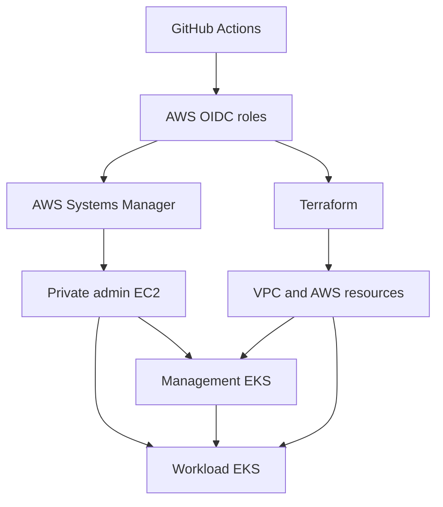
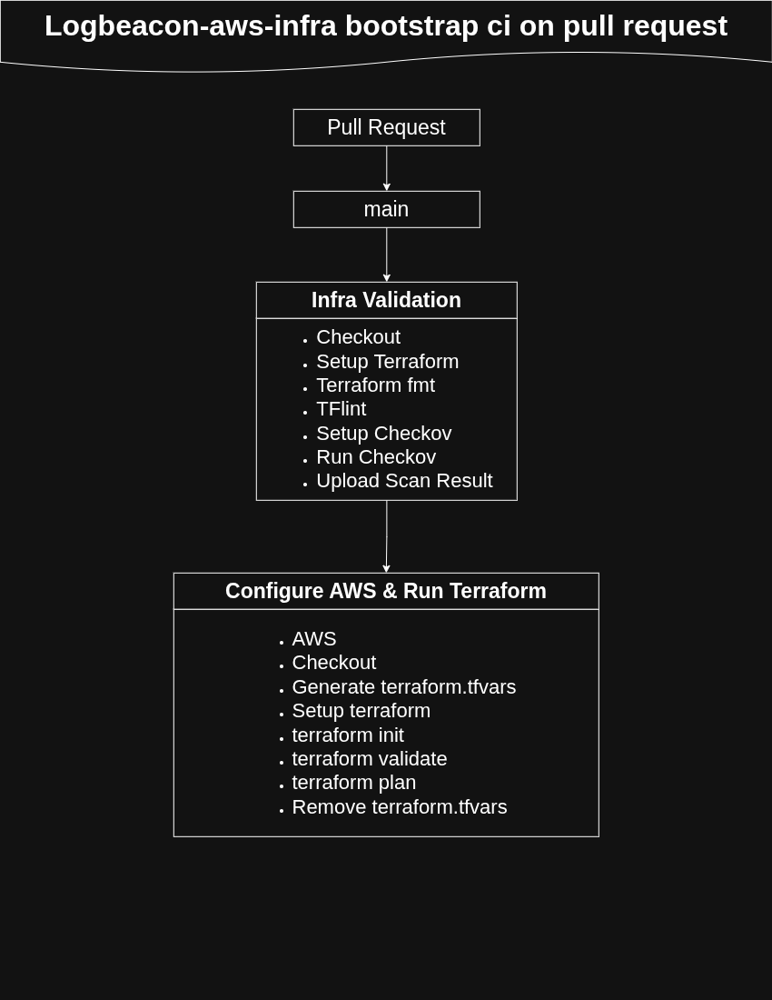
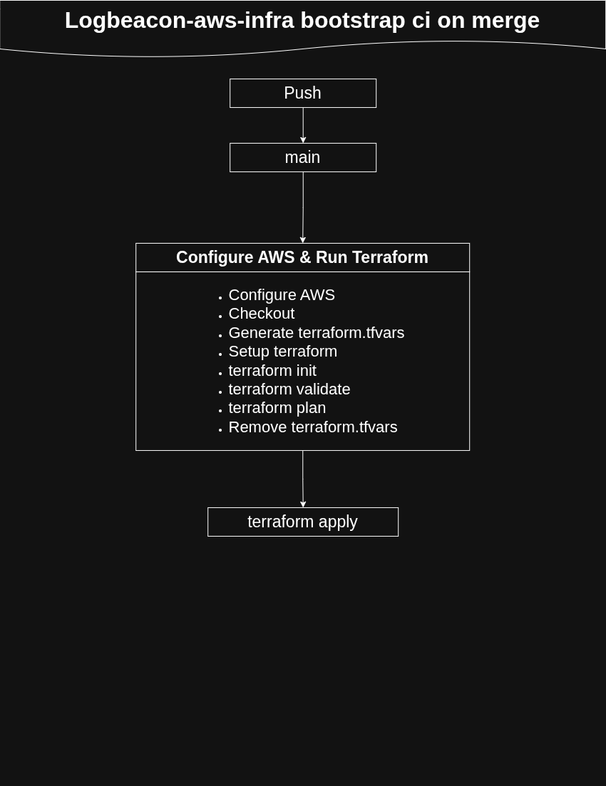
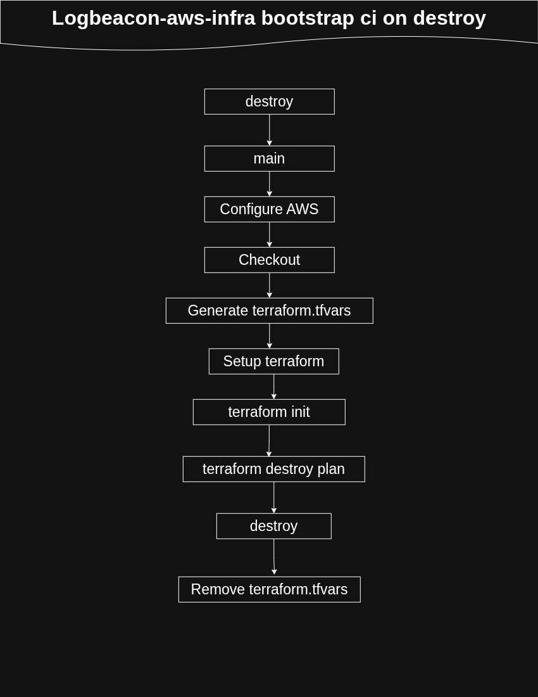
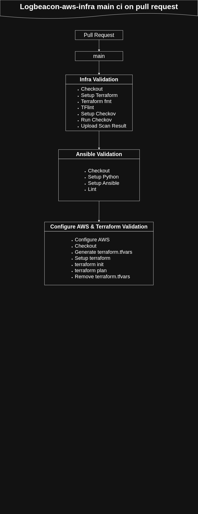
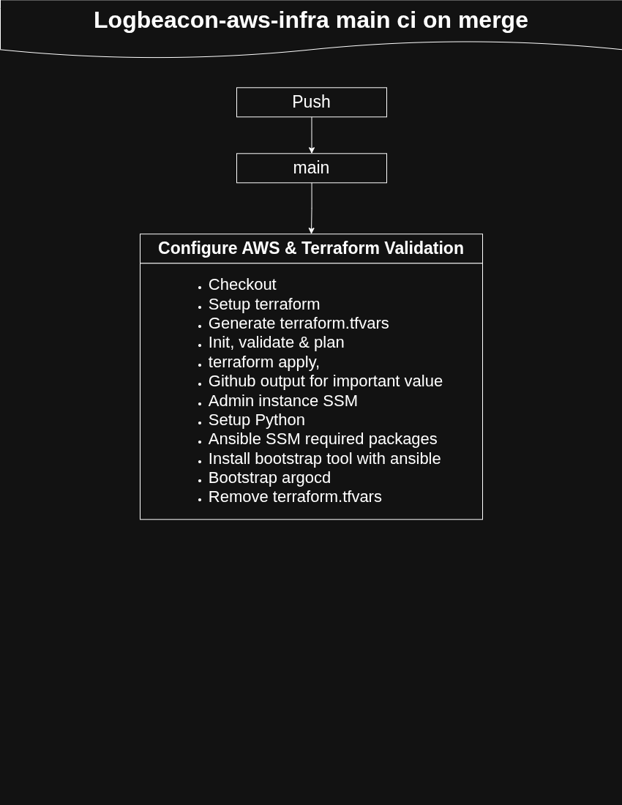
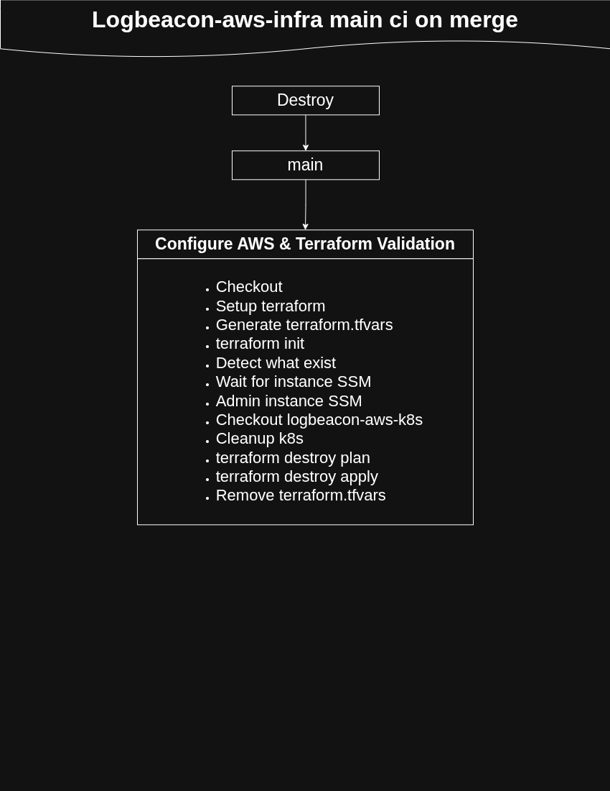

# LogBeacon — AWS Infrastructure

This repository provisions the AWS foundation for LogBeacon, an application
that analyzes developer error logs using a Groq-hosted language model.
Terraform creates the network, two private Amazon EKS clusters, container
registries, IAM roles, encryption keys, and application secrets. Ansible
prepares a private EC2 administration host, and the main deployment workflow
uses that host to bootstrap Argo CD through AWS Systems Manager.

The two-cluster design separates the GitOps management plane from the
application workloads. GitHub Actions reaches the administration host
through SSM; Kubernetes administration happens from inside the VPC.

## The LogBeacon repositories

| Repository | Responsibility |
| --- | --- |
| [logbeacon-app](https://github.com/iamridoydey/logbeacon-app) | Express/EJS frontend, Flask API, migrations, tests, and ECR image releases. |
| **[logbeacon-aws-infra](https://github.com/iamridoydey/logbeacon-aws-infra)** | AWS infrastructure, CI identities, secrets, and private administration access. |
| [logbeacon-aws-k8s](https://github.com/iamridoydey/logbeacon-aws-k8s) | Kubernetes platform services, Argo CD applications, routes, and canary deployments. |

If you only want to run the application locally, follow the application
repository's README. This repository creates billable AWS resources.

## Contents

- [Architecture](#architecture)
- [Terraform roots and repository layout](#terraform-roots-and-repository-layout)
- [Prerequisites](#prerequisites)
- [Adapt the configuration to your account](#adapt-the-configuration-to-your-account)
- [Local Deployment](#local-deployment)
- [Admin host and Kubernetes bootstrap](#admin-host-and-kubernetes-bootstrap)
- [GitHub Actions configuration](#github-actions-configuration)
- [What to configure before each pipeline](#what-to-configure-before-each-pipeline)
- [Validation](#validation)
- [Troubleshooting and known setup gaps](#troubleshooting-and-known-setup-gaps)
- [Teardown](#teardown)
- [Deploy through ci/cd](#deploy-through-cicd)
- [Contributing and documentation basis](#contributing-and-documentation-basis)

## Architecture



### Provisioned resources

| Component | Current configuration |
| --- | --- |
| Region | `us-east-1` by default. |
| VPC | `10.0.0.0/16`, three public and three private subnets across three availability zones. |
| Outbound networking | Internet gateway and one NAT gateway. Private nodes/admin host use outbound connectivity for AWS APIs, packages, and images. |
| Management EKS | Kubernetes `1.33`, private API endpoint, private worker nodes; two desired `t3.medium` nodes, range 2–3. |
| Workload EKS | Kubernetes `1.33`, private API endpoint, private worker nodes; two desired `t3.large` nodes, range 2–4. |
| Admin EC2 | Ubuntu 22.04, `t3.small`, private subnet, no public IP, encrypted gp3 root volume, IMDSv2 required. |
| Admin access | SSM; no inbound security-group rule. Outbound TCP 80/443 supports package installation and HTTPS access. |
| ECR | Private `logbeacon/frontend` and `logbeacon/backend` repositories, immutable tags, scan on push. Keep the latest 50 tagged images; expire untagged images after 14 days. |
| Storage support | Workload EBS CSI driver and its Pod Identity role. Kubernetes owns application PVCs/EBS volumes. |
| Encryption | Separate customer-managed KMS keys for both EKS clusters and Secrets Manager. |
| Secrets | Application, database, SMTP, Cloudflare, GitHub, workload-cluster connection details, and SonarQube credentials. |
| S3 | Ansible/SSM transfer bucket and access-log bucket. The Terraform state bucket is an external prerequisite. |

Both clusters include CoreDNS, kube-proxy, the VPC CNI, and the EKS Pod
Identity agent. The workload cluster also includes the EBS CSI add-on.
PostgreSQL runs inside Kubernetes; this repository does not create RDS.

Argo CD's management-cluster identity assumes a separate workload-cluster
role. EKS access entries authorize that role, the admin EC2 role, and the
admin EC2's IAM instance profile independently on each cluster it needs to
reach. Cluster-creator administrator access is disabled, so an AWS identity
that can create the clusters does not automatically have Kubernetes
administrator access — every identity that needs `kubectl` access is
granted it explicitly, by its own access entry.

**Sizing and availability:** the single NAT gateway, small initial node
groups, and disabled module CloudWatch log-group creation reflect the
current project configuration. Review capacity, availability, logging, and
backup requirements for your deployment. Changing the `environment` variable
alone does not create an isolated environment: many resource names and
backend keys are fixed.

## Terraform roots and repository layout

Apply the three Terraform roots in dependency order — each one creates the
identity the next root authenticates with, so they cannot be reordered:

| Order | Directory | Purpose | S3 state key |
| --- | --- | --- | --- |
| 1 | `terraform/manual-infra/` | GitHub OIDC provider and `bootstrap-infra-role`; applied with an authorized local AWS identity. | `manual-infra.terraform.tfstate` |
| 2 | `terraform/bootstrap-infra/` | Infrastructure PR/apply roles, app CI role, and their policies. | `bootstrap-infra.terraform.tfstate` |
| 3 | `terraform/main-infra/` | VPC, clusters, EC2, registries, secrets, KMS, and Pod Identity associations. | `logbeacon.terraform.tfstate` |

All roots currently use the `logbeacon-state-file` bucket in `us-east-1`,
with encryption and S3 lockfiles enabled. Each has its own state and lock;
initialize and operate on each directory separately.

### `local.terraform.tfvars` — the source of truth for every value you need

**Every Terraform root ships its own `local.terraform.tfvars`.** This file
is not consumed by Terraform directly — it's a checked-in template holding
every variable that root expects, filled with clearly-labeled dummy values.
It exists specifically so you never have to guess what a root needs or dig
through `variables.tf` yourself:

```bash
cp terraform/manual-infra/local.terraform.tfvars terraform/manual-infra/terraform.tfvars
# edit terraform.tfvars, replacing each dummy value with the real one
```

Repeat the same pattern for `bootstrap-infra` and `main-infra`. `terraform.tfvars`
is git-ignored; `local.terraform.tfvars` is committed and safe to read, since
it never contains a real secret — only the key names and placeholder shapes.

**This same file is also the definitive list of what needs to become a
GitHub secret or variable**, once you move from local deployment to CI —
each key in `local.terraform.tfvars` corresponds to exactly one GitHub
secret or variable, referenced in the matching workflow's `terraform.tfvars`
generation step. If a key's dummy value looks like a real secret
(a password, a token, an API key), it belongs in GitHub as a **secret**; if
it's a plain identifier (a region, a username, an environment name), it
belongs as a **variable**. The [GitHub Actions
configuration](#github-actions-configuration) section below maps each one
explicitly, but `local.terraform.tfvars` is the file to check first if this
repository's variables ever change and the tables below go stale.

Other important paths:

| Path | Purpose |
| --- | --- |
| `ansible/playbook.yaml` | Installs AWS CLI, kubectl, and Helm on the admin host. |
| `ansible/roles/` | Tool-installation roles. |
| `terraform/main-infra/templates/inventory.tpl` | SSM inventory template. |
| `ansible/inventory.ini` | Generated by main Terraform apply; ignored by Git. |
| `.github/workflows/bootstrap-ci-*.yaml` | Bootstrap IAM plan, apply, and destroy workflows. |
| `.github/workflows/main-ci-*.yaml` | Main infrastructure plan, apply/bootstrap, and destroy workflows. |

## Prerequisites

- An AWS account and an authorized local identity for the first deployment;
  use a named profile or SSO credentials.
- AWS CLI v2, Git, and Terraform. Align the Terraform version across every
  workflow and your local machine before deploying — a mismatch between the
  version pinned in one workflow and another (or your local install) can
  produce different plans for the same configuration. The `>= 1.0.0`
  constraint declared in each root is not, by itself, a sufficient
  compatibility guarantee for S3 lockfiles and the specific modules used
  here.
- An S3 bucket for Terraform state, created before `terraform init`.
- For Ansible: Python, `ansible`, `boto3`, `botocore`, the `amazon.aws`
  collection, and the AWS Session Manager plugin installed on the machine
  running Ansible.
- A Cloudflare-managed DNS zone and a token that can manage the intended DNS
  records and ACME challenges.
- Groq and SMTP credentials, plus GitHub credentials for image-update pull
  requests.
- Capacity/quota for two EKS clusters, their node groups, an EC2 admin
  instance, a NAT gateway, EBS volumes, and load balancers created later by
  Kubernetes.

The resource IAM policies, OIDC conditions, state configuration, and
Kubernetes values are specific to this project. Review and adapt them for a
fork before applying.

## Adapt the configuration to your account

Before starting:

1. Choose globally unique state, Ansible transfer, and log bucket names.
   Update all three `backend.tf` files, `bootstrap-infra/locals.tf`,
   `manual-infra/variables.tf`, and `main-infra/ansible-config.tf`, plus any
   associated policy references.
2. Review `project_name`, cluster/IAM/KMS names, subnet CIDRs, availability
   zones, and region. Region changes must also update backend configuration
   and the Kubernetes repository.
3. Fill in `local.terraform.tfvars` → `terraform.tfvars` for each root with
   your own GitHub owner and any repository identifiers the trust policies
   reference.
4. Check the actual OIDC `sub` claim (and any additional claims, such as
   `repository_id`/`repository_owner_id`) your workflows produce against the
   generated role trust policies in `ci-iam.tf`, for both `bootstrap-infra`
   and `manual-infra`. Do not assume a format copied from this project
   matches a newly created fork — GitHub environments also change the
   subject issued for a job, which is why several roles in this project
   trust multiple subject patterns at once (a plain branch ref, plus one
   `environment:<name>` pattern per environment that assumes the role).
5. Update account IDs, ECR URLs, GitHub URLs, DNS names, and ACME contact
   email in the Kubernetes repository before allowing Argo CD to reconcile
   it.

The `environment` input is required, but it is mostly a tag input. Multiple
environments need deliberately distinct state keys and resource names.

## Local Deployment

The local sequence below makes each stage explicit. After the initial
identities exist, the GitHub workflows can manage subsequent changes — see
[Deploy through ci/cd](#deploy-through-cicd).

### 1. Clone and select your AWS identity

```bash
git clone https://github.com/iamridoydey/logbeacon-aws-infra.git
cd logbeacon-aws-infra
export AWS_PROFILE=your-authorized-profile
export AWS_REGION=us-east-1
aws sts get-caller-identity
```

Use a profile that is independently authorized to manage these resources.
The CI roles trust GitHub web-identity tokens; they are not automatically
assumable from a local IAM user or from the AWS root account.

### 2. Prepare remote state

Have an account administrator create your chosen state bucket before
initialization. For a **new** bucket in `us-east-1`:

```bash
STATE_BUCKET=replace-with-your-unique-state-bucket
aws s3api create-bucket --bucket "$STATE_BUCKET" --region us-east-1
aws s3api put-bucket-versioning --bucket "$STATE_BUCKET" \
  --versioning-configuration Status=Enabled
aws s3api put-public-access-block --bucket "$STATE_BUCKET" \
  --public-access-block-configuration \
  BlockPublicAcls=true,IgnorePublicAcls=true,BlockPublicPolicy=true,RestrictPublicBuckets=true
aws s3api put-bucket-encryption --bucket "$STATE_BUCKET" \
  --server-side-encryption-configuration \
  '{"Rules":[{"ApplyServerSideEncryptionByDefault":{"SSEAlgorithm":"AES256"}}]}'
```

For an existing deployment, use its existing bucket/state; do not create
empty replacement state. Update the source backend and policy references to
the bucket you chose. Backend blocks do not read ordinary Terraform input
variables.

Authorized Terraform identities need bucket listing, state-object access,
and get/put/delete access to the corresponding `.tflock` object. State
contains secret values even when inputs are marked `sensitive`; keep state
and saved plans private. See the [Terraform S3 backend
documentation](https://developer.hashicorp.com/terraform/language/backend/s3).

### 3. Apply the manual root

```bash
cp terraform/manual-infra/local.terraform.tfvars terraform/manual-infra/terraform.tfvars
# edit terraform.tfvars with your real GitHub owner / repository identifiers
```

```bash
terraform -chdir=terraform/manual-infra init
terraform -chdir=terraform/manual-infra validate
terraform -chdir=terraform/manual-infra plan -out=tfplan
terraform -chdir=terraform/manual-infra apply tfplan
```

If the account already has the GitHub OIDC provider, reconcile/import the
existing provider into the intended state instead of trying to create a
duplicate. This root has no dedicated CI workflow — it stays a local,
one-time step for the life of the AWS account.

### 4. Apply the bootstrap root

```bash
cp terraform/bootstrap-infra/local.terraform.tfvars terraform/bootstrap-infra/terraform.tfvars
# edit terraform.tfvars with your real values
```

```bash
terraform -chdir=terraform/bootstrap-infra init
terraform -chdir=terraform/bootstrap-infra validate
terraform -chdir=terraform/bootstrap-infra plan -out=tfplan
terraform -chdir=terraform/bootstrap-infra apply tfplan
```

This creates `logbeacon-infra-bootstrap-pr-role`, `logbeacon-infra-bootstrap-ci-role`,
and `logbeacon-app-ci-role`. Their names describe their workflow purpose;
inspect the policies in `ci-iam.tf` for their actual scope, including state
and secret access.

### 5. Apply the main root

```bash
cp terraform/main-infra/local.terraform.tfvars terraform/main-infra/terraform.tfvars
chmod 600 terraform/main-infra/terraform.tfvars
# edit terraform.tfvars — this file holds real application secrets once filled in
```

```bash
terraform -chdir=terraform/main-infra init
terraform -chdir=terraform/main-infra validate
terraform -chdir=terraform/main-infra plan -out=tfplan
terraform -chdir=terraform/main-infra apply tfplan
terraform -chdir=terraform/main-infra output
```

Review each plan before applying. Do not commit saved plans or Terraform
state; `terraform.tfvars` is git-ignored, but this does not cover every
possible plan/state filename you might generate locally — check before
committing.

If you change database username/database values from what
`local.terraform.tfvars` shows, also update `infra/postgres-values.yaml` in
the Kubernetes repository to match. Groq model, SMTP host, retention, and
other non-secret settings live in Kubernetes ConfigMaps, not here.

### Secrets created by the main root

| AWS secret | Contents / consumer |
| --- | --- |
| `logbeacon/app` | `SECRET_KEY`, `GROQ_API_KEY`, `SESSION_SECRET`. |
| `logbeacon/database` | `POSTGRES_USER`, `POSTGRES_PASSWORD`, `POSTGRES_DB`. |
| `logbeacon/smtp` | `SMTP_USER`, `SMTP_PASSWORD`, `FROM_EMAIL`. |
| `logbeacon/cloudflare` | `ACCOUNT_ID`, `API_TOKEN`, `ZONE_ID`. |
| `logbeacon/sonarqube-passcode` | `MONITORING_PASSCODE`; separate from the admin password. |
| `github-secret` | `USERNAME`, `TOKEN` for the image updater. |
| `workload-eks-cred` | Workload endpoint, CA, cluster name, and assumed-role ARN for Argo CD. |
| `sonarqube-admin-password` | `ADMIN_PASSWORD`. |
| `sonarqube-ci-cred` | Secret container only; the Kubernetes SonarQube bootstrap job is intended to write `SONAR_HOST_URL` and `SONAR_TOKEN`. |

The Kubernetes README documents the bootstrap-job first-run issue that must
be resolved before the empty CI secret can be populated automatically.

## Admin host and Kubernetes bootstrap

Local `terraform apply` creates infrastructure and the Ansible inventory. It
does **not** run the Ansible playbook or install Argo CD. The main CI apply
workflow performs those additional steps automatically; the commands below
are for running the equivalent steps by hand.

### Prepare the host with Ansible

```bash
python3 -m venv .venv
source .venv/bin/activate
python -m pip install ansible boto3 botocore
ansible-galaxy collection install amazon.aws
session-manager-plugin --version

ansible-playbook ansible/playbook.yaml -i ansible/inventory.ini
```

Install the [Session Manager
plugin](https://docs.aws.amazon.com/systems-manager/latest/userguide/session-manager-working-with-install-plugin.html)
first if the version command is unavailable. The SSM connection also needs
the instance online in Systems Manager, SSM permissions for the invoking
identity, and access to the configured S3 transfer bucket. A fresh checkout
of existing infrastructure may need its generated inventory recreated from
the template and current instance ID.

### Connect interactively

```bash
ADMIN_INSTANCE_ID=$(terraform -chdir=terraform/main-infra output -raw logbeacon_admin_ec2_id)
aws ssm start-session --target "$ADMIN_INSTANCE_ID" --region us-east-1
```

**A plain interactive SSM session logs you in as `ssm-user`, not `root`.**
The CI pipeline's automated steps run as `root` (via SSM `send-command`,
which defaults to that user), and write `~/.kube/config` to
`/root/.kube/config`. `ssm-user` cannot read that file. Either switch users
first —

```bash
sudo -i
```

— or generate your own kubeconfig as `ssm-user` directly:

```bash
aws sts get-caller-identity
aws eks update-kubeconfig --region us-east-1 \
  --name logbeacon-management-cluster --alias management
aws eks update-kubeconfig --region us-east-1 \
  --name logbeacon-workload-cluster --alias workload
kubectl --context management get nodes
kubectl --context workload get nodes
```

Either approach authenticates identically — the permission comes from the
instance's IAM role, not from which Linux user happens to be running the
command. Replace cluster names if you changed `project_name`. Do not copy
local profile credentials onto the instance. A laptop without VPC
connectivity cannot reach these private Kubernetes endpoints merely by
downloading a kubeconfig.

### Install Argo CD

First review the deployment prerequisites and migration corrections in the
Kubernetes repository's README. On the admin host, ensure Git is installed,
clone your reviewed Kubernetes repository, and bootstrap the management
cluster:

```bash
git clone https://github.com/iamridoydey/logbeacon-aws-k8s.git
cd logbeacon-aws-k8s
helm repo add argo https://argoproj.github.io/argo-helm
helm repo update
helm upgrade --install argocd argo/argo-cd \
  --kube-context management \
  --namespace argocd --create-namespace --wait \
  -f argocd/argocd-values.yaml
kubectl --context management apply -f argocd/management-root.yaml
kubectl --context management -n argocd get applications
```

Use your fork URL when applicable. The current bootstrap does not pin the
Argo CD chart version; pin a reviewed version for reproducible
installations. Applying the root enables automatic reconciliation, so its
Git URLs, credentials, images, and deployment settings must already be
ready.

## GitHub Actions configuration

### Variables and secrets

Every entry below traces back to a key in one of the three roots'
`local.terraform.tfvars` files — see [that section
above](#localterraformtfvars--the-source-of-truth-for-every-value-you-need)
if this table and your actual repository ever disagree.

| GitHub setting | Type | Purpose |
| --- | --- | --- |
| `AWS_REGION` | Variable | Region for AWS workflow commands; keep consistent with Terraform/backend settings. |
| `ENVIRONMENT` | Variable | Terraform `environment` input, every root. |
| `GH_USERNAME` | Variable | GitHub owner; also used when cloning the Kubernetes repository on the admin host. |
| `GH_ACCOUNT_ID` | Variable | GitHub owner numeric ID — confirm current usage against `ci-iam.tf` (see caveat below). |
| `GH_REPO_ID` | Variable | Infrastructure repository numeric ID — same caveat. |
| `GH_LOGBEACON_APP_REPO_ID` | Variable | Application repository numeric ID — same caveat. |
| `AWS_ACCOUNT_ID` | Secret | Account used in every IAM role ARN. |
| `LOGBEACON_SECRETS` | Secret | HCL object matching `logbeacon_secrets`. |
| `CLOUDFLARE_SECRETS` | Secret | HCL object matching `cloudflare_secrets`. |
| `GH_SECRETS` | Secret | HCL object matching `github_secrets`. |
| `SONARQUBE_ADMIN_PASSWORD` | Secret | SonarQube administrator password. |
| `SONARQUBE_MONITORING_PASSCODE` | Secret | SonarQube monitoring passcode. |

For the three object-valued secrets, save the object itself — for example
`{ username = "owner", token = "token" }` — with no surrounding quotes and
no variable-name prefix. Workflows interpolate these directly into HCL
unquoted; wrapping the value in quotes anywhere in the chain produces
invalid `terraform.tfvars` and fails the run with a multi-line-string
parsing error.

> **Confirm before relying on this:** whether `GH_ACCOUNT_ID`, `GH_REPO_ID`,
> and `GH_LOGBEACON_APP_REPO_ID` are still consumed by the OIDC trust-policy
> condition in `ci-iam.tf`, and if so, whether they're applied as GitHub's
> own native claims (`repository_id` / `repository_owner_id`, checked
> independently from `sub`) rather than concatenated directly into the
> subject string. A subject built as `repo:<user>@<id>/<repo>@<id>:...` is
> not a format GitHub's OIDC provider ever issues, and a trust policy
> expecting it will reject every real token with "Not authorized to perform
> sts:AssumeRoleWithWebIdentity" — a failure that looks like a permissions
> problem but is actually a malformed condition. If your fork's trust
> policy uses that shape, fix the condition (drop the `@id` fragments, or
> move the IDs into their own claim-based condition keys) before assuming
> these three values are simply inputs to supply.

Repository-level secrets/variables are available to PR jobs that don't
select a GitHub environment. Environment-scoped values are only visible to
jobs that reference that environment. PRs opened from forks normally cannot
access the repository's secrets at all, regardless of scope.

### Workflow behavior

| Workflow | Trigger / environment | Operations |
| --- | --- | --- |
| `bootstrap-ci-pr.yaml` | PR to `main`, bootstrap path filters | Formatting check, TFLint, Checkov, init/validate/plan using `bootstrap-infra-role`. |
| `bootstrap-ci-merge.yaml` | Push to `main` with matching paths, or manual; `bootstrap-production` | Plan and apply bootstrap IAM. |
| `bootstrap-ci-destroy.yaml` | Manual, confirmation `DESTROY`; `bootstrap-destroy` | Destroy bootstrap IAM. Run only after `main-infra` is already destroyed. |
| `main-ci-pr.yaml` | PR to `main`, main/Ansible path filters | Terraform checks, Ansible checks, and plan using the PR role. |
| `main-ci-merge.yaml` | Push to `main` with matching paths, or manual; `main-infra-production` | Apply main resources, run Ansible, and bootstrap Argo CD through SSM. |
| `main-ci-destroy.yaml` | Manual on `main`, confirmation `destroy`; `main-infra-destroy` | Clean Kubernetes resources through SSM, then destroy main Terraform resources. |

Create the referenced environments in GitHub and configure required
reviewers if approval gates are desired. Declaring an environment in
workflow YAML alone does not configure reviewers — without at least one
reviewer set under **Settings → Environments**, the job proceeds
immediately with no pause.

## What to configure before each pipeline

The tables above list everything at once; this section orders the same
values by when each is first needed, since several pipelines cannot succeed
until an earlier one has already run.

### Before anything runs

Set the repository-level values once: `AWS_ACCOUNT_ID`, `AWS_REGION`,
`ENVIRONMENT`, `GH_USERNAME` — plus confirm every environment referenced by
workflow YAML exists with at least one required reviewer.

### Before the bootstrap PR pipeline will pass

Just the repository-level settings above, plus a `bootstrap-infra-role`
already created by [Apply the manual root](#3-apply-the-manual-root). This
pipeline only formats, lints, and plans — it never touches real state, so
nothing else is required.

### Before the bootstrap merge (apply) pipeline will succeed

Same as the PR pipeline, plus `bootstrap-production` must have a required
reviewer configured — otherwise the apply runs with no pause.

### Before the main-infra PR pipeline will pass

Requires `bootstrap-infra` to already be applied, so
`logbeacon-infra-bootstrap-pr-role` exists, plus every secret consumed by
`terraform.tfvars` generation: `LOGBEACON_SECRETS`, `GH_SECRETS`,
`CLOUDFLARE_SECRETS`, `SONARQUBE_ADMIN_PASSWORD`,
`SONARQUBE_MONITORING_PASSCODE`.

### Before the main-infra merge (apply) pipeline will succeed

Everything above, plus `main-infra-production` needs a required reviewer,
and the assumed role's policy must cover more than just `terraform apply` —
this pipeline also needs `ssm:SendCommand`/`ssm:GetCommandInvocation`
against the admin instance and read access to the public
`arn:aws:ssm:*::parameter/aws/service/eks/*` parameter namespace the EKS
module queries during node group creation. A role that can apply Terraform
but not reach SSM will fail partway through the run, after real
infrastructure already exists.

### Before either destroy pipeline will run as intended

Both require a literal confirmation string typed into the
`workflow_dispatch` input (`DESTROY` for bootstrap, `destroy` for
main-infra) in addition to their environment's approval gate — both checks
are independent and both must pass.

**Always destroy `main-infra` completely first.** Its destroy pipeline
authenticates with a role that `bootstrap-infra` owns; destroying
`bootstrap-infra` first removes that role and strands the main-infra
destroy pipeline mid-teardown, unable to authenticate. See
[Teardown](#teardown) for the full sequence.

## Validation

From the repository root, validate each Terraform root separately:

```bash
terraform fmt -check -recursive terraform

for root in manual-infra bootstrap-infra main-infra; do
  terraform -chdir="terraform/$root" init -backend=false
  terraform -chdir="terraform/$root" validate
done

tflint --chdir=terraform/main-infra --init
tflint --chdir=terraform/main-infra --recursive
checkov -d terraform/main-infra --framework terraform
ansible-playbook --syntax-check ansible/playbook.yaml
ansible-lint ansible/playbook.yaml
```

Backend-free initialization is useful in a clean validation checkout; it
still downloads providers/modules. Use normal initialization before a
state-backed plan/apply. Repeat lint/security checks for any root you
change. Validation does not prove AWS permissions, quotas, API
reachability, or a successful runtime deployment.

## Troubleshooting and known setup gaps

| Problem | Explanation / action |
| --- | --- |
| `terraform init` cannot access S3 | The state bucket must already exist, and backend configuration plus IAM references must match it exactly. |
| SonarQube CI cannot read its encrypted secret | The app role's bootstrap policy includes Secrets Manager reads but no KMS decrypt grant for the key that secret is encrypted with. Add the scoped key access before running application analysis CI. |
| `AssumeRoleWithWebIdentity` denied despite a seemingly correct role | Check the trust policy's `sub` condition character-for-character against a real token — a malformed subject (extra fields, wrong delimiter) produces this exact error and looks identical to a genuine permissions problem. |
| `kubectl` on the admin host says `localhost:8080 refused` | You're in an interactive SSM session as `ssm-user`, which has no kubeconfig of its own — the CI pipeline's kubeconfig lives at `/root/.kube/config`. See [Connect interactively](#connect-interactively). |
| A cluster's public SSM AMI parameter lookup fails with `AccessDeniedException` | The apply role needs a separate, un-tagged statement granting `ssm:GetParameter` on `arn:aws:ssm:*::parameter/aws/service/eks/*` — this is an AWS-owned, account-less parameter, so any statement scoped by a resource tag condition will never match it. |
| EKS API unreachable from the admin host despite correct Access Entries | Access Entries only govern authorization once a request reaches the API server — confirm the cluster's security group actually allows inbound 443 from the admin host's security group (or CIDR) as well; Access Entries and security groups are two independent gates. |

Also align Terraform versions across every workflow and your local
toolchain. Formatting failures are marked `continue-on-error` in PR
workflows, so a failing `fmt` check will not block a plan from running —
review its output manually. Provider lockfiles are ignored, so provider
selections may differ between fresh checkouts.

## Teardown

Back up application data first. The infrastructure is configured with
destructive cleanup behavior: ECR repositories allow force deletion,
transfer/log buckets allow force deletion, Secrets Manager resources use a
zero-day recovery window, and KMS keys have a seven-day deletion window. The
Kubernetes gp3 StorageClass uses reclaim policy `Delete`.

Use this dependency order:

1. Stop GitOps reconciliation and clean up Kubernetes-managed routes,
   gateways, `LoadBalancer` Services, and application storage while the
   clusters and controllers still exist. Deleting these first, before the
   controllers that manage them are gone, is what lets AWS actually release
   the load balancers and volumes behind them — deleting the cluster first
   would orphan those AWS resources outside Terraform's knowledge entirely.
2. Destroy `main-infra`. The provided main destroy workflow performs
   Kubernetes cleanup through SSM before applying its destroy plan. Keep
   `skip_k8s_cleanup=false` for the normal path.
3. Check AWS for leftover load balancers, ENIs, EBS volumes, and DNS
   records — namespace/storage cleanup in the workflow has best-effort
   portions and is not guaranteed to catch everything.
4. Destroy `bootstrap-infra` only after workloads/main infrastructure are
   confirmed gone.
5. Destroy `manual-infra` last, only if its OIDC provider is not shared by
   other repositories. Retain state backups according to your needs.

After Kubernetes cleanup, a local main-root destroy plan can be reviewed
explicitly instead of running the CI pipeline:

```bash
terraform -chdir=terraform/main-infra plan -destroy -out=destroy.tfplan
# Run only after reviewing the destructive plan:
terraform -chdir=terraform/main-infra apply destroy.tfplan
```

The destroy workflow removes non-core namespaces in these dedicated
clusters. Do not run it against clusters containing unrelated workloads.
Destroying cluster infrastructure before Kubernetes-managed resources are
cleaned up can leave resources that Kubernetes created outside Terraform's
state entirely — untracked, and easy to miss during a billing review.

## Deploy through ci/cd

The [Local Deployment](#local-deployment) section above applies all three
Terraform roots by hand. Once `manual-infra` exists, every subsequent change
to `bootstrap-infra` and `main-infra` can instead go through the workflows
below. `manual-infra` has no CI workflow — it stays a local, one-time step
regardless of which path you take for the other two roots.

Before using this path, confirm the `local.terraform.tfvars` variables, secrets, and environments in
[GitHub Actions configuration](#github-actions-configuration) are already
set, including required reviewers on each environment — see [What to
configure before each pipeline](#what-to-configure-before-each-pipeline) for
the exact requirements per workflow.

### Bootstrap infrastructure

Opening a pull request against `terraform/bootstrap-infra/**` runs
formatting, TFLint, Checkov, and `terraform plan` using `bootstrap-infra-role`.
This job requires no approval — it only reads state to produce a diff.




Review the plan output in the PR before merging.

Merging to `main` starts the apply workflow automatically, but the apply job
pauses at the `bootstrap-production` environment until a required reviewer
approves it. Once approved, it applies `bootstrap-infra`, creating
`logbeacon-infra-bootstrap-pr-role`, `logbeacon-infra-bootstrap-ci-role`, and
`logbeacon-app-ci-role` — see [Terraform roots and repository
layout](#terraform-roots-and-repository-layout) for what each is scoped to.



Destroying bootstrap infrastructure is manual-dispatch only, gated by the
`bootstrap-destroy` environment and a literal `DESTROY` confirmation input.
Run this only after confirming `main-infra` has already been destroyed — see
[Teardown](#teardown) for why the order matters and cannot be reversed.



### Main infrastructure

With `bootstrap-infra` applied, `logbeacon-infra-bootstrap-pr-role` exists,
and a pull request against `terraform/main-infra/**` or `ansible/**` can run
its own validation and plan automatically — Terraform checks, Ansible syntax
check and lint, then `terraform plan`.



Merging starts the apply workflow, pausing at `main-infra-production` for
approval. Once approved, this single run applies `main-infra`, waits for the
admin instance's SSM agent to report online, runs the Ansible playbook
against it over the `aws_ssm` connection, then sends the Argo CD bootstrap
script via `send-command` — installing Argo CD on the management cluster and
applying `management-root.yaml`. See [Admin host and Kubernetes
bootstrap](#admin-host-and-kubernetes-bootstrap) for what that script does
in detail if you're running the equivalent steps by hand instead.



After this run completes, Argo CD's own reconciliation loop takes over —
subsequent application changes flow through `logbeacon-app` and
`logbeacon-aws-k8s`'s own pipelines, not this repository's.

Destroying main infrastructure is manual-dispatch only, gated by the
`main-infra-destroy` environment and a literal `destroy` confirmation input.
The workflow performs Kubernetes cleanup through SSM — scaling Argo CD to
zero, then deleting Ingresses and `LoadBalancer` Services so the underlying
AWS load balancers are released — before running `terraform destroy`. Keep
`skip_k8s_cleanup=false` unless the cluster is already unreachable; see
[Teardown](#teardown) for the full ordering and what to check for
afterward.



## Contributing and documentation basis

Use a feature branch and a pull request to `main`; include the relevant
Terraform plan and validation results, with secret values removed. Keep
IAM, Kubernetes service-account names, GitHub environments, and backend
paths consistent across repositories.

Reviewed against infrastructure commit
[`05be61d`](https://github.com/iamridoydey/logbeacon-aws-infra/tree/05be61d618541c2ff4f1dd19f21f501acfd4c8ee).
Configuration and commands were checked against source and this project's
own CI history; sections marked **Confirm before relying on this** could not
be independently re-verified against the live repository at the time of
writing and should be checked directly before treating them as settled.